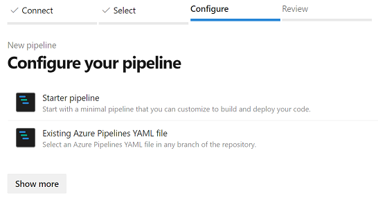

## Demo Rule CI/CD Pipeline
Starting a DevOps pipeline is one of the possible actions triggered on catalog events.  This is an example of a pipeline setup that can use the version of the rule application, involved in the catalog event, to run regression tests and, on success, promote the rule application to another catalog.  

This example is based on the repo available at https://github.com/InRule/DemoRuleCICDPipeline.

### Catalog-Based : Test and Promote upon irCatalog Check In

The flow of actions proceeds in this order:

1. A rule application being checked into the irCatalog triggers the start of the DevOps build pipeline.
2. The rule application is retrieved from the catalog and run against all Test Scenarios that exist in the folder set in the yaml template file.
3. If all test scenarios pass, the rule application is promoted from the source irCatalog instance to the target irCatalog instance - i.e. from Development to UAT

#### Requirements
- The InRule CI/CD solution must be running and the DevOps action configured with the pipeline coordinates.
- The binaries for the two helpers must be available in GitHub or in the DevOps repo, one for executing regression tests and one for promoting a rule application.
- [The template YAML file](yaml/catalogSourced-TestAndPromote.yml) must be present, so it can be referenced by the second YAML file with the parameters deciding: rule application name, source and destination environments, and the corresponding label to use in each environment, like in the example below and in the [sample YAML file](yaml/InRule_Build_DEV_UAT.yml).  Note that a dedicated YAML file would be required for a combination of source and destination environments.
    ``` 
    RuleAppName: InvoiceRules
    SourceCatalogName: DEV
    DestinationCatalogName: UAT
    SourceLabel: LIVE
    DestinationLabel: LIVE
    ``` 
- The appropriate InRuleLicense.xml file is saved in the Library Secure File store
- The source credential variables have been set in a CatalogCredentialsDEV Library Variable Group store.  Note that a naming convention was employed for this example, with the environment moniker used a suffix for the parameters with values for the environment name, URI, and credentials.
	- CatalogUriDEV
	- CatalogUsernameDEV
	- CatalogPasswordDEV (secret)

    
- The appropriate destination credential variables have been set in a CatalogCredentialsUAT Library Variable Group store
	- CatalogUriUAT
	- CatalogUsernameUAT
	- CatalogPasswordUAT (secret)
- The build pipeline has to be created in DevOps and set with the YAML file containing the reference to the template YAML and the parameters of the run.

### Creating and configuring the build pipeline in DevOps

Once all the other elements are in place, it is easy to simply create a new build pipeline and choose the repository where the two or more YAML files.  So far, we have tested with GitHub and DevOps repo and expect no issues with any of the other sources available:


For the GitHub choice, once the repository is selected and for the way our example works, the correct selection is "Existing Azure Pipelines YAML file":



Where the YAML file for the desired pair of source/destination environments can be chosen:


