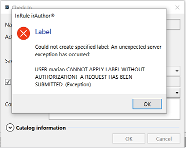
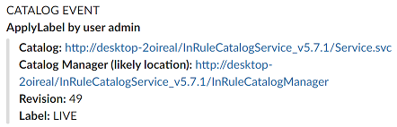
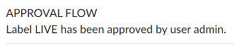
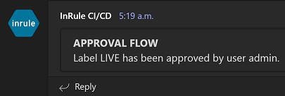
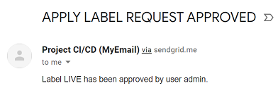

### CI/CD Approval Flow

When integrating InRule with their applications, most InRule customers prefer to use labels for the method employed to retrieve the desired rule application version from the catalog.  There are obvious benefits over always using the latest revision or having to specify the exact revision number.  As a result, assigning a label to the just promoted rule application version from an environment to another, like from UAT to production, is the final step in enabling the promoted version.

As a result, other than the rule application promotion itself, this action of applying the label is very important, because it can decide what rules are active in a production environment, hence affecting business crucial systems.  With the InRule CI/CD framework, we provide a way for intercepting the requests for label assignment to a rule application revision, making it subject to a human confirmation.

Since only check in events are tracked at this time with the CI/CD catalog poller, the approval flow is not available without the CI/CD listener components deployed to the catalog instance.

Only some catalog users get to be designated as approvers, leaving all others in the group of users requiring an approval to assign the label to a revision.  These are the actors and corresponding events that make up the approval flow:

* Given UserA and UserB being user accounts with rights in the InRule catalog, UserA is set as the approver and UserB remains a regular user requiring UserA's approval, through configuration.
* UserB attempts to change the label assignment between two revisions of a rule application.  Note that all labels and rule applications are subject to these rules.
* The InRule CI/CD listener component intercepts the attempt for label assignment, blocks it, and displays an error in irAuthor or any other tool used for calling the catalog service.

    

* Also, a message is sent to the notification channel set for UserB, the requester of the label assignment.

    

* At the same time, a message is sent to UserA ("admin" in the example), with the details of the action and a link that, once clicked, completes the action attempted by UserB and assigns the label to the intended revision.
* The intended unapproved label does not get applied and, instead, a "PENDING xx" label is assigned to the rule application revision, where xx stands for the actual revision number.

    

* On approval, the "PENDING xx" label is replaced with the intended label in its assignment to the correct revision.  A confirmation message is sent to both UserA and UserB, action triggered along with any other actions set for OnApplyLabel event.

    **Slack**
    
    

    

    ---
    **Teams**

    

    ---
    **Email**

    

---
## Configuration

### irCatalog Service Configuration

|Configuration Key | Comments
--- | ---
|ApprovalFlow.**ApplyLabelApprover**| The username, as defined in the catalog, designated as approver of all label change actions.
|ApprovalFlow.**NotificationChannel**| The space separated list of monikers corresponding to the notification channels where the approver receives messages regarding the approval flow.
|ApprovalFlow.**RequesterNotificationChannel**| The space separated list of monikers corresponding to the notification channels where the requester receives messages regarding the approval flow, like the confirmation that the label they asked for has been applied.
|ApprovalFlow.**FilterByLabels**| The space separated list of labels to which the approval flow will apply.  For instance, the label LIVE designates the revision that will be picked up by a build process and promoted to a higher environment, so setting the value of this parameter to "LIVE" will ensure that only approved assignments are allowed. 

Since the ApplyLabel event is intercepted on the Catalog service, in order to block the action and initiate the approval flow, it is necessary to provide the ApplyLabelApprover value in the Catalog service's configuration.

For Azure, the configuration follows the format in the [Azure catalog config file with approval flow entry](../config/InRule.Catalog.Service_ApprovalFlow.config.json).

```
  {
    "name": "ApprovalFlow.ApplyLabelApprover",
    "value": "admin",
    "slotSetting": false
  }
```

For IIS hosted irCatalog service, the configuration entry is below and in [catalog config file with approval flow entry](../config/InRule.Catalog.Service_ApprovalFlow.config): 

```
  <add key="ApprovalFlow.ApplyLabelApprover" value="admin"/>
```

### InRule CI/CD Service Configuration

Other than the initial error message thrown by the catalog service when an unapproved user applies a label, the rest of the actions related to the approval flow are processed by the InRule CI/CD service.

For Azure, the configuration follows the format in the [Azure CI/CD config file with approval flow entries](../config/InRuleCICD_ApprovalFlow.config.json).

```
  {
    "name": "ApprovalFlow.ApplyLabelApprover",
    "value": "admin",
    "slotSetting": false
  },
  {
    "name": "ApprovalFlow.NotificationChannel",
    "value": "Slack Email",
    "slotSetting": false
  },
  {
    "name": "ApprovalFlow.RequesterNotificationChannel",
    "value": "MyTeams MySlack MyEmail",
    "slotSetting": false
  }
```

For IIS hosted CI/CD service, the configuration entry is below and in [CI/CD file with approval flow entries](../config/InRuleCICD_ApprovalFlow.config): 

```
  <add key="ApprovalFlow.NotificationChannel" value="Slack Email"/>
  <add key="ApprovalFlow.RequesterNotificationChannel" value="MyTeams MySlack MyEmail"/>
  <add key="ApprovalFlow.ApplyLabelApprover" value="admin"/>
```
