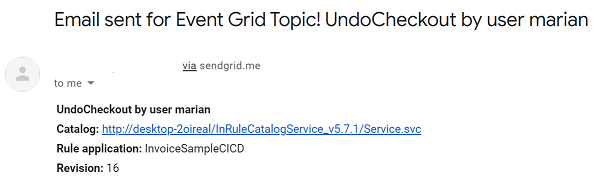
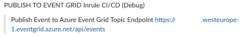

### Distributing Catalog Events to an Azure Event Grid Topic 

The [Microsoft documentation](https://docs.microsoft.com/en-us/azure/event-grid/) is the best place for learning about Azure Event Grid concepts and for getting access to quick start guides, examples, and other details.

_An event grid topic provides an endpoint where the source sends events. The publisher creates the event grid topic, and decides whether an event source needs one topic or more than one topic. A topic is used for a collection of related events. To respond to certain types of events, subscribers decide which topics to subscribe to._

The InRule® customer can choose to use either Service Bus or Event Grid with the InRule CI/CD framework, depending on the specifics of their solution, with some hints below:

|Service | Purpose | Type | When to use
--- | --- | --- | ---
|Event Grid| Reactive programming | Event distribution (discrete) | React to status changes
|Service Bus|High-value enterprise messaging | Message | Order processing and financial transactions

The structure of the event data sent to the Event Grid topic complies with the [Azure Event Grid event schema](https://docs.microsoft.com/en-us/azure/event-grid/event-schema):

```
[
  {
    "topic": string,
    "subject": string,
    "id": string,
    "eventType": string,
    "eventTime": string,
    "data":{
      object-unique-to-each-publisher
    },
    "dataVersion": string,
    "metadataVersion": string
  }
]
```

_A subscription tells Event Grid which events on a topic you're interested in receiving. When creating the subscription, you provide an endpoint for handling the event. You can filter the events that are sent to the endpoint. You can filter by event type, or subject pattern._

With the InRule CI/CD framework, we provide a simple example of an Azure function that can be used to subscribe to the set Event Grid topic and send an email with the event details. The steps for setting up the Azure function and for routing events to it are covered at [Route custom events to an Azure Function with Event Grid](https://docs.microsoft.com/en-us/azure/event-grid/custom-event-to-function).


The same SendGrid account settings can be used for sending the emails.  This is only a basic example of how to use the Event Grid notifications for further actions.



Each customer can decide the exact handling of Event Grid topic messages with their own subscription and either custom code or by leveraging one of the out-of-the-box configurable solutions available in Azure.

**Before using InRule CI/CD with Azure Service Bus topics, a number of items have to be first created under the Azure portal**, as per the steps described on page [Use the Azure portal to create a Service Bus topic and subscriptions to the topic](https://docs.microsoft.com/en-us/azure/service-bus-messaging/service-bus-quickstart-topics-subscriptions-portal).  Depending on the specifics of the intented end-to-end solution, a subscription to the topic and further connected functionality would have to be created in Azure before leveraging the irCatalog service events. 

For the InRule CI/CD configuration, we need the SB namespace connection string and the name of the topic just created.  

Sending InRule catalog events to an Azure Service Bus topic is not an action that produces an immediate outcome, at least not one that can be configured in InRule CI/CD.  By default, the effects of this integration can be seen in InRule CI/CD only as debug notifications, on the channels configured for this purpose, like in the Slack example below:




---
#### Configuration

In order to enable the distribution of catalog events to an Azure Service Bus topic, the minimal configuration can be seen in the [sample configuration file](../config/InRuleCICD_EventGrid.config), which is **applicable for a local deployment**.  **For the Azure CI/CD app service**, the configuration follows the format in the [starter cloud config file](../config/InRule.CICD.Runtime.Service.config.json).

```
<appSettings>
  ...
  <add key="CatalogEvents" value="CheckinRuleApp"/>

  <add key="OnCheckinRuleApp" value="EventGrid"/>
  
  <add key="EventGrid.EventGridTopicEndpoint" value="https://*******.westeurope-1.eventgrid.azure.net/api/events"/>
  <add key="EventGrid.EventGridTopicKey" value="********************************"/>
</appSettings>
```

|Configuration Key | Comments
--- | ---
|EventGrid.**EventGridTopicEndpoint**| The event grid topic provides an endpoint where the source sends events. The publisher creates the event grid topic, and decides whether an event source needs one topic or more than one topic. A topic is used for a collection of related events. To respond to certain types of events, subscribers decide which topics to subscribe to.
|EventGrid.**EventGridTopicKey**| Event Grid provides security for subscribing to topics, and publishing topics. When subscribing, you must have adequate permissions on the resource or event grid topic. When publishing, you must have a SAS token or key authentication for the topic. For more information, see [Event Grid security and authentication](https://docs.microsoft.com/en-us/azure/event-grid/security-authentication).
