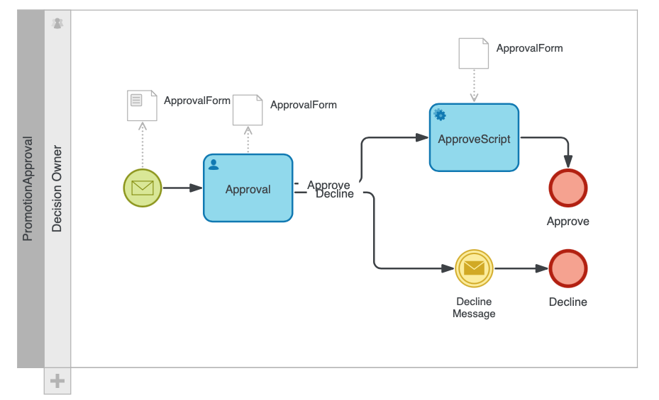
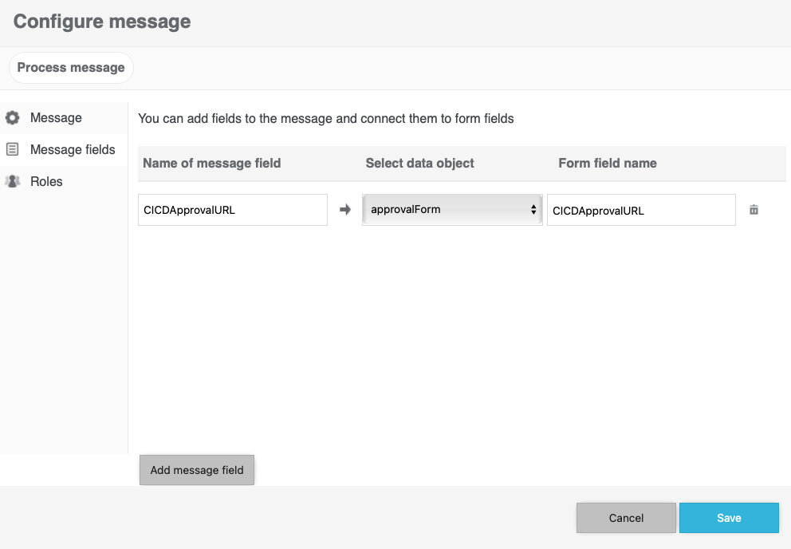

### Barium Live Integration with CI/CD

InRule CI/CD now supports performing actions in Barium Live.  Any lifecycle event from InRule irCatalog can create a process instance within a Barium Live deployment. 


---
#### Configuration

All relevant aspects of this integration are set in the configuration under the default Barium moniker (see example below).  Create instance is an extension of the Barium configuration to further define specific activities that can take place in Barium. Prior to configuration, a valid process model must be deployed.

Below is a [sample of minimal configuration](../config/InRuleCICD_BariumCreateInstance.config) for creating a process instance in Barium Live when a rule application has been checked in. This configuration example is **applicable for a local deployment**.  **For the Azure CI/CD app service**, the configuration follows the format in the [starter cloud config file](../config/InRule.CICD.Runtime.Service.config.json).
<dl><br /></dl>
  
````
    <add key="CatalogEvents" value="CheckinRuleApp"/>
    <add key="OnCheckinRuleApp" value="Barium"/>
  
    <add key="Barium.Host" value="************************************************"/>
    <add key="Barium.APIVersion" value="v1.0"/>
    <add key="Barium.Username" value="C:\Temp\"/>
    <add key="Barium.Password" value="C:\Temp\"/>
    <add key="Barium.Apikey" value="Slack"/>
    <add key="Barium.Webticket" value="GitHub"/>

    <add key="Barium.CreateInstance" value="true"/>
	<add key="Barium.CreateInstance.Template" value="form"/>
	<add key="Barium.CreateInstance.Message" value="START"/>
	<add key="Barium.CreateInstance.ProcessName" value="IntegrationTesting"/>
````
<dl><br /></dl>

|Configuration Key | Comments
--- | ---
|Barium.**Host**| The host name of the Barium Live environment.
|Barium.**APIVersion**| The version of the API. Default is v1.0.
|Barium.**Username**| The username of the integration user with permissions to access the API and the process to create an instance from.
|Barium.**Password**| The password of the integration user.
|Barium.**Apikey**| The API key that has been created in Barium.
|Barium.**Webticket**| Set to true to authenticate with Barium.
|Barium.**CreateInstance**| Set to true to enable the create instance activity.
|Barium.**CreateInstance.Template**| The template defined in the Barium process to create an instance from.
|Barium.**CreateInstance.Message**| The start message configured in the Barium process.
|Barium.**CreateInstance.ProcessName**| The name of the Barium process to create an instance from.


<dl><br /></dl>

#### Approval workflow with a Barium Process

With the latest release, administrators can now pass the generated approval link (a static URL generated for approving a label change) into a Barium Live process instance.  From there, the administrator has all of the capabilities provided by the Barium Live product to route and track approvals.  Below are the configuration settings you need to pass the approval link.

````
<add key="BariumLive.Host" value="https://bariuminstancename.yourdomain.com"/>
<add key="BariumLive.APIVersion" value="v1.0"/>
<add key="BariumLive.Username" value="youruser@yourdomain.com"/>
<add key="BariumLive.Password" value="******************"/>
<add key="BariumLive.Apikey" value="*******************************"/>
<add key="BariumLive.Webticket" value="true"/>
<add key="BariumLive.Template" value="form"/>
<add key="BariumLive.Message" value="Start"/>
<add key="BariumLive.ProcessName" value="PromotionApproval"/> <!--Can be any process name-->
<add key="BariumLive.ApprovalUrlField" value="CICDApprovalURL"/> <!--You can pass any field name so long as it's the same end-to-end-->
````

This is what a Barium Live approval process looks like.  If you are already a Barium Live user, [click here](PromotionApproval.bmap) to download the process example for your own environment.



Configure your start event message to accept the static URL from the CI/CD service.  Not the names match the example above:

