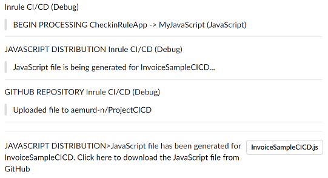
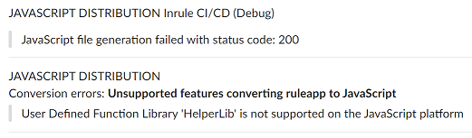

### Generate JavaScript Rule Application with irDistribution Service

InRule® currently offers the ability to convert a compatible rule application into a JavaScript® (js) file.  A subscription key is required before calling the irDistribution™ service converting the rule application into JavaScript.

Excepting this InRule CI/CD framework, there are 3 ways to package a rule application into JavaScript:
* Using the InRule for JavaScript website
* Calling the irDistribution service from your own code or process
* Directly from within irAuthor®
 
For an overview of the InRule JavaScript feature, check [Execute rules in the browser, in mobile apps, or anywhere JavaScript can run!](https://inrule.com/platform-overview/execute/javascript/).

_InRule for JavaScript allows for native rule execution in JavaScript. It supports any browser or JavaScript engine that is ECMA Script 5 compatible._

_irDistribution is the core of InRule for JavaScript. This service packages business rules authored in irAuthor, along with the rule engine and the SDK required to run your rules, into a single minified JavaScript file. The irDistribution service features an HTTP API, allowing for integrations such as build / continuous integration processes, which makes it easy to deploy rule changes in the same manner as any other changes in an application._

_InRule for JavaScript gives you the ability to run rules in any environment that can execute JavaScript while still creating and maintaining the rules using irAuthor. The same rule application can be used in both the .NET and JavaScript rule engine._

Any time rules change in irAuthor, you must re-package the rule application into JavaScript and re-deploy into your application, which is where the CI/CD solution can prove very useful at automating this process.

The sample output below, for both debug and normal Slack notifications, tracks how the file is sent to the distribution service, the result retrieved and uploaded to GitHub, and the link to the js file posted at the conclusion of the event handling:



There are certain rule application elements that cannot be converted to JavaScript, in which case the InRule CI/CD JavaScript step fails.  Many features of a rule application are applicable both to the InRule rules engine and to InRule for JavaScript. In irAuthor, the irX® for JavaScript extension allows you to select which platform(s) a particular rule application will run on.

The messages posted to the notification channels show the outcome and the reason, like in the example below:



#### Accessing the website and your subscription key

The irDistribution service uses an HTTP interface which exposes primarily one method that you'll be using. This method, appropriately named "package", accepts a rule application in the body of a POST request and returns a JavaScript file. Authentication is handled by including an API subscription key in a custom "subscription-key" header of the request.

To package a rule application, you must have an authorized irDistribution user account and subscription key. You should have received your credentials to access the website from InRule. If you did not receive credentials, please contact your InRule Account Executive. 

The subscription key is tied to your user account. Upon successful login to the website (https://distribution.inrule.com/), your subscription key will be available to you.  You will need that subscription key to package JavaScript via the irDistribution service and from within the irX for JavaScript authoring extension.

---
#### Configuration

The InRule CI/CD JavaScript component automates this step by calling the irDistribution service with the revision of the rule application involved in the captured catalog event, using the client subscription key.

All relevant aspects of this integration are set in the configuration, under the default "JavaScript" moniker.  Like for all other CI/CD event handlers, it is possible to create any number of configuration groups with 'type="JavaScript"', which can then be used with any of the intercepted catalog events.

This is a [sample of minimal configuration](../config/InRuleCICD_JavaScript.config) for generating the JavaScript file for the rule application being checked in. This configuration example is **applicable for a local deployment**.  **For the Azure CI/CD app service**, the configuration follows the format in the [starter cloud config file](../config/InRule.CICD.Runtime.Service.config.json).

````
<add key="CatalogEvents" value="CheckinRuleApp"/>
<add key="OnCheckinRuleApp" value="JavaScript"/>

<add key="JavaScript.JavaScriptDistributionApiKey" value="aaaaaaaa-bbbb-cccc-dddd-eeeeeeeeeeee"/>
<add key="JavaScript.JavaScriptDistributionUri" value="https://api.distribution.inrule.com/"/>
<add key="JavaScript.JavaScriptDistributionOutPath" value="C:\Temp\"/>
<add key="JavaScript.NotificationChannel" value="Slack"/>
<add key="JavaScript.UploadTo" value="GitHub"/>
````

|Configuration Key | Comments
--- | ---
|JavaScript.**JavaScriptDistributionApiKey**| The key provided by InRule for access to the JavaScript distribution service, coming with the specific license.
|JavaScript.**JavaScriptDistributionUri**| The URI for the InRule JavaScript distribution service.
|JavaScript.**JavaScriptDistributionOutPath**| The local folder used as the temporary location for saving the generated JavaScript file before upload to either GitHub or Box.com. For the Azure deployment with CI/CD service, this location is overridden with the default TEMP location for the app service.
|JavaScript.**NotificationChannel**| The channel(s) where normal notifications are sent.  Since this action must return a link to where the js file is located, or post the errors that prevented the conversion to JavaScript, it requires a decision for which channel(s) to use.  
|JavaScript.**UploadTo**| Either GitHub or Box.com. Once completed successfully, the outcome of this action is a notification with the download link for the js file.
