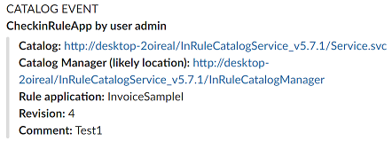
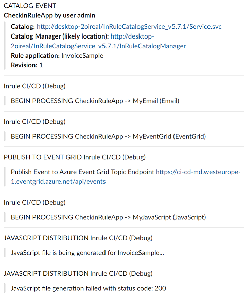
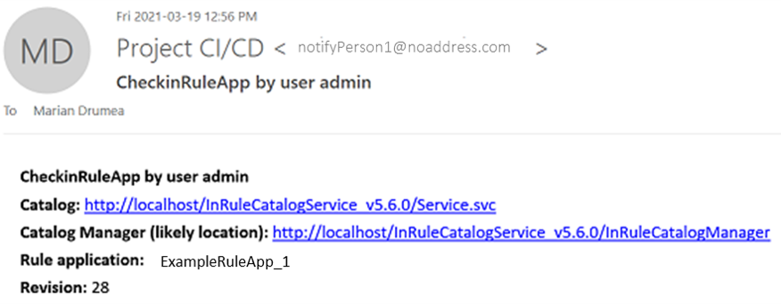
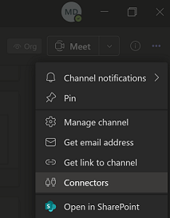
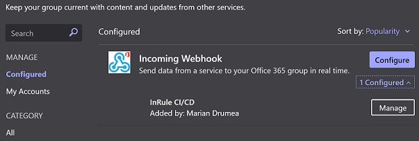

## Notifications

Notifications about catalog events can be considered the most basic use case covered by the InRule® CI/CD framework.  The notifications contain details of the events intercepted by the catalog service listener.  For instance, for a check-in event, a Slack message can be posted with these data:



#### Normal vs. Debug notifications

At a minimum, the InRule CI/CD framework can be configured to post basic notifications of the events being captured by the listener.  Since more complex event handling is possible, the same notification channels will receive any relevant results posted for the additional actions.  For example, if a rule application report is created for the revision being checked in, the completion message and the link for retrieving the report are posted to the chosen notification channel.  This behavior applies to all event handlers that require an outcome.  This level of notification is called "**normal**".

The other notification level is "**debug**" and it makes for more verbose messaging, like details of the steps during handler actions.  The decision, for which notification channels receive debug messages, is made using the configuration item:

---
##### Configuration
```
<add key="DebugNotifications" value="MySlack EventLog Teams"/>
```


|Configuration Key | Comments
--- | ---
|**DebugNotifications**| Space separated list of monikers for the channels where debug messages are posted.  The available channel types are: Slack, Teams, EventLog, and Email (SendGrid).    

Example debug notifications in Slack, under "InRule CI/CD (Debug)" entries:



---
### Notification Configuration Samples

The initial offering comes with a number of notification channels: **Slack, Teams, and Email** (via SendGrid).  All configuration examples below are **applicable for a local deployment**.  **For the Azure CI/CD app service**, the configuration follows the format in the [starter cloud config file](../config/InRule.CICD.Runtime.Service.config.json).

1. **Slack** - Before being able to use Slack channels as recipients of any data from the InRule CI/CD framework, a number of steps are required, as described under [Configure Slack for InRule CI/CD](InRuleCICD_Slack.md).  All Slack messages have minimal markdown formatting.

    ##### Configuration

     |Configuration Key | Comments
    --- | ---
    |Slack.**SlackWebhookUrl**| The URL or list of URL's corresponding to the channels to which the messages are posted by InRule CI/CD.  Webhooks URL's for multiple channels can be provided and multiple combinations can be configured for different purposes, as explained next. 
   

    In order  to simply receive basic details of any check in event, the first step is to add the "CheckInRuleApp" moniker to the space separated list of entries under the CatalogEvents.  This ensures the CI/CD framework is subscribed to the check in event.

    [Sample configuration file for Slack](../config/InRuleCICD_Slack.config)

    ````
    <add key="CatalogEvents" value="CheckinRuleApp ApplyLabel OverwriteRuleApp />
    ````

    Next, we have to decide what happens when the catalog check in event is captured, namely the list of the actions, out of the available ones included with the solution.  For the basic Slack notifications, we simply list the "Slack" moniker under the "OnCheckinRuleApp" configuration entry:

    ```
    <add key="OnCheckinRuleApp" value="Slack" />
    ```

    In this case, "Slack" is the reference to the default Slack configuration, like below.  The word "Slack" used as prefix for the confitguration key determines both the type of configuration and its name.  Any configuration file, that includes a Slack handler, must include at least a "Slack.SlackWebhookUrl" entry.  
    
    ```
    <add key="Slack.SlackWebhookUrl" value="https://hooks.slack.com/services/xxxxxxxxx/xxxxxxxx/xxxxxxxxxxxxxxxxxxx
     https://hooks.slack.com/services/yyyyyyyyy/yyyyyyyy/yyyyyyyyyyyyyyyyyyy"/>
    ```
    
    It is possible to define alternate Slack channels or combinations of channels for different events.  For this, we can add any number of configuration groups that are labeled as Slack configuration entries with 'type="Slack"', like below:

    ````
    <add key="MySlack.Type" value="Slack"/>
    <add key="MySlack.SlackWebhookUrl" value="https://hooks.slack.com/services/zzzzzzzzz/zzzzzzzzzzzzzz" />
    ````

    Then, we can decide to use the new Slack webhook, called "MySlack", corresponding to a different channel in Slack, to post notifications referring to the apply label event.

    ````
    <add key="OnApplyLabel" value="MySlack MyApprovalFlow"/>
    ````
 
    This is minimal InRule CI/CD configuration file content to start using the framework with only Slack messaging.
---    
2. **Email** - The same kind of messages sent to Slack can be sent to other channels, another one being Email.  The formatting is different, to accommodate the differences between markdown for Slack and a text or HTML email body, but the content is the same.  Also, emails can be sent for both normal or debug notification levels.

    

    Specific configuration details are required for sending emails using SendGrid.  TBD page with SendGrid configuration.  Once the SendGrid account is configured, the items below must be set before the InRule CI/CD framework can send emails:

    ````
    <add key="Email.SendGridApiKey" value="SG.xxxxxxxxxxxxxxxxxxxxxxxxxxxxxxxxxxxxxxxxxx"/>
    <add key="Email.EmailSendFrom" value="notifyPerson1@noaddress.com"/>
    <add key="Email.EmailSendFromName" value="Project CI/CD"/>
    <add key="Email.EmailSendTo" value="notifyPerson1@noaddress.com, notifyPerson2@noaddress.com"/>
    <add key="Email.EmailSendToName" value="Anna Kim (Corporate)"/>
    ````

    The configuration keys below were used when generating the example in the screenshot above.  The "Email" prefix is used for the default configuration, which is mandatory for the email notification channel.

    ##### Configuration

    [Sample configuration file for Email (SendGrid)](../config/InRuleCICD_Email.config)

    |Configuration Key | Comments
    --- | ---
    |Email.**SendGridApiKey**| As per [SendGrid documentation](https://sendgrid.com/docs/ui/account-and-settings/api-keys/):  "Your application, mail client, or website can all use API (Application Programming Interface) keys to authenticate access to SendGrid services. They are the preferred alternative to using a username and password because you can revoke an API key at any time without having to change your username and password. We suggest that you use API keys for connecting to all of SendGrid’s services."
    |Email.**EmailSendFromName**| The email address that will show on the "From" field for the email being sent.
    |Email.**EmailSendTo**| The value used for the "To", determining to which email(s) the message will be sent.  The message can be distributed to one or more email addresses.  When more recipients are needed, the addresses must be separated by spaces in the configuration value string, like in the example above. 
    |Email.**EmailSendToName**| The friendly name associated with the address being used in the "To" configuration key.
---
3. **Teams** - A channel in Microsoft Teams can receive notifications, both normal and debug, like the Slack channels.  Similarly, Teams also requires the webhook URL's.  Channels can be added and configured in the Teams application, under channel's "more options" -> Connectors -> Incoming Webhooks.  The URL can be set/found on the webhook's configuration screen.

     

    Example configuration for directing check-in events to the Teams channel set as default and undo check-out to another channel using moniker "MyTeams":
    ```
    <add key="OnCheckinRuleApp" value="Teams" />
    <add key="OnUndoCheckout" value="MyTeams"/>

    <add key="MyTeams.TeamsWebhookUrl" value="https://xxxxxxx.webhook.office.com/webhookb2/yyyyyyyyyyyyyyyyyyyyyy/IncomingWebhook/zzzzzzzzzzzzzzzzzzzzzzz1"/>
    
    <add key="MyTeams.Type" value="Teams"/>
    <add key="MyTeams.TeamsWebhookUrl" value="https://xxxxxxx.webhook.office.com/webhookb2/yyyyyyyyyyyyyyyyyyyyyy/IncomingWebhook/zzzzzzzzzzzzzzzzzzzzzzz2"/>

    ```

    ##### Configuration

   [Sample configuration file for Teams](../config/InRuleCICD_Teams.config)

     |Configuration Key | Comments
    --- | ---
    |Teams.**TeamsWebhookUrl**| The URL or list of URL's corresponding to the channels to which the messages are posted by InRule CI/CD.  Webhooks URL's for multiple channels can be provided and multiple combinations can be configured for different purposes under new configuration section with type "Teams". 
