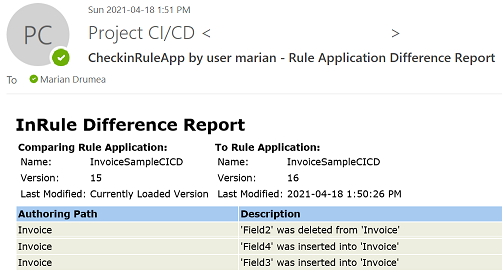

### Generate a Rule Application Difference Report in Response to Catalog Events

The Difference Report compares different revisions of the same rule application and displays the differences between the revisions. It is possible to compare the revisions in irAuthor®, by selecting the Difference button in the Reports group on the ribbon.  The other method available before the InRule CI/CD framework is via custom irSDK® code.

NOTE: The Difference Report was not designed to compare different rule applications entirely. It uses an underlying unique identifier for each rule element to do the comparison, and therefore is intended only to be used to compare different revisions of the same rule application.

Example of a rule application difference report sent via email:



---
#### Configuration

In order to enable the report generation and distribution with the InRule® CI/CD solution, a number of configuration entries are required.  Here is [a sample configuration file](../config/InRuleCICD_RuleAppDiffReport.config) with the necessary items for deciding that the difference report will be created on check-in and where it will be distributed.  This configuration example is **applicable for a local deployment**.  **For the Azure CI/CD app service**, the configuration follows the format in the [starter cloud config file](../config/InRule.CICD.Runtime.Service.config.json).

For this reporting action, the normal notifications are used for posting either the report content or the link to where the file is uploaded.  Therefore, it is mandatory to provide at least one such channel, which can be of type Slack (link), Teams (link), or Email (HTML report). 


```
<appSettings>
  <add key="IsCloudBased" value="false"/>
  <add key="AesEncryptDecryptKey" value="*************************"/>
  <add key="FilterEventsByUser" value="admin marian"/>
  <add key="DebugNotifications" value="Slack"/>
  
  <add key="CatalogUsername" value="admin"/>
  <add key="CatalogPassword" value="********"/>
  
  <add key="CatalogEvents" value="CheckinRuleApp"/>

  <add key="OnCheckinRuleApp" value="RuleAppDiffReport"/>
  
  <add key="RuleAppDiffReport.NotificationChannel" value="Slack Email"/>
  <add key="RuleAppDiffReport.UploadTo" value="GitHub"/>
  
  <add key="Slack...."/>
  
  <add key="Email..."/>
  
  <add key="GitHub..."/>
</appSettings>
```

|Configuration Key | Comments
--- | ---
|RuleAppDiffReport.**NotificationChannel**| A single moniker or a space separated list of monikers for the configuration sections for where the report will be distributed.  Choices for configuration types: Slack (link to HTML report), Teams (link to HTML report), or Email (HTML report)].
|RuleAppDiffReport.**UploadTo**| For the notification channels receiving a link to the location where the HTML report is uploaded, the current monikers for available choices are: GitHub (for uploading to a location on GitHub.com) and Box (for Box.com).  Each of these options must be configured in the same configuration file, with the same moniker used under the UploadTo value.
