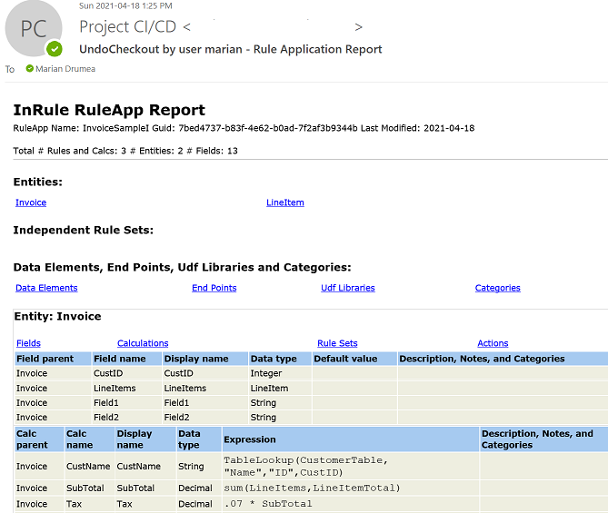
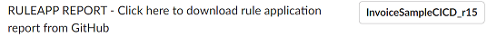

### Generate a Rule Application Detail Report in Response to Catalog Events

The Rule Application Detail Report lists all entities, fields, calculations, rules, notifications and actions that define the rule application.  The report is grouped by entity with an index of entity hyperlinks for ease of navigation.  Other than using this InRule® CI/CD framework, it is possible to generate a rule application report from irAuthor®, for the loaded rule application, or via custom irSDK® code.

Since the rule application details report contains a representation of the rules which can be reviewed without the need of irAuthor, generating and distributing the HTML file is useful for a number of scenarios.

Example of a rule application report (only partly visible) sent via email:



And an example of the download link sent to Slack:



---
#### Configuration

In order to enable the report generation and distribution with the InRule CI/CD solution, a number of configuration entries are required.  Here is [a sample configuration file](../config/InRuleCICD_RuleAppReport.config) with the necessary items for deciding that the report will be created on check-in and where it will be distributed. This configuration example is **applicable for a local deployment**.  **For the Azure CI/CD app service**, the configuration follows the format in the [starter cloud config file](../config/InRule.CICD.Runtime.Service.config.json).

For this reporting action, the normal notifications are used for posting either the report content or the link to where the file is uploaded.  Therefore, it is mandatory to provide at least one such channel, which can be of type Slack (link), Teams (link), or Email (HTML report).  


```
<appSettings>
  <add key="IsCloudBased" value="false"/>
  <add key="AesEncryptDecryptKey" value="*************************"/>
  <add key="FilterEventsByUser" value="admin marian"/>
  <add key="DebugNotifications" value="Slack"/>
  
  <add key="CatalogUsername" value="admin"/>
  <add key="CatalogPassword" value="********"/>
  
  <add key="CatalogEvents" value="CheckinRuleApp"/>

  <add key="OnCheckinRuleApp" value="RuleAppReport"/>
  
  <add key="RuleAppReport.NotificationChannel" value="Slack Email"/>
  <add key="RuleAppReport.UploadTo" value="GitHub"/>
  
  <add key="Slack...."/>
  
  <add key="Email..."/>
  
  <add key="GitHub..."/>
</appSettings>
```

|Configuration Key | Comments
--- | ---
|RuleAppReport.**NotificationChannel**| A single moniker or a space separated list of monikers for the configuration sections for where the report will be distributed.  Choices for configuration types: Slack (link to HTML report), Teams (link to HTML report), or Email (HTML report)].
|RuleAppReport.**UploadTo**| For the notification channels receiving a link to the location where the HTML report is uploaded, the current monikers for available choices are: GitHub (for uploading to a location on GitHub.com) and Box (for Box.com).  Each of these options must be configured in the same configuration file, with the same moniker used under the UploadTo value.
