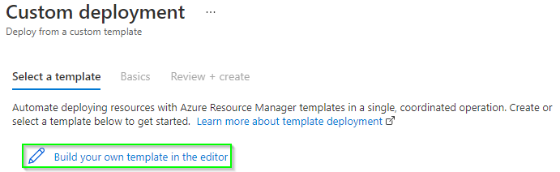

## ARM Template Deployment
Deploying DevOps with an ARM template is highly recommended. A push button is below, as well as instructions on importing the ARM templates in the Azure Portal. 

DevOps App Service Deployment

DevOps Enabled Catalog App Service Deployment

* First download the [CI/CD ARM template zip file](https://github.com/InRule/CI-CD/raw/main/releases/InRule.DevOps.ARMTemplates.zip).
* From the Azure Portal search for **Deploy a custom template**.
* Once the custom deployment screen loads select **Build your own template in the editor**.

    

* Select **Load file** on the next screen and upload the **InRule.DevOps.Runtime.Service.json** from the zip file downloaded above. Once loaded click **Save** at the bottom of the screen.

    

* Now load the paramaters file by clicking **Edit parameters**. On the next screen select **Load file** again and load the **InRule.DevOps.Runtime.Service.parameters.json** file. Click **Save** once complete. 
  
    

* Choose the resource group to be used and Iif installing a new service leave **Create Or Update DevOps Service Plan** as **true** and type the desired DevOps app service name, app service plan and plan Sku. If upgrading set to **false** and enter the existing app service plan and app service name where DevOps was previosuly installed. A finished example is below:

    

* The last step is to deploy the license file to the newly created DevOps app service. This can easily be done by using the App Service Editor from within the DevOps app service. Under the Development Tools in the left hand navigation of the app service click the app service editor as shown below, then click **Go** when that page loads. Right click on some blank space under WWWROOT and click **Upload Files** to upload the InRuleLicense.xml file. 

    

* The app service editor can also be launched from the KUDU console by adding .scm before the base URL and add dev at the end. Here is an example: https://mysite.scm.azurewebsites.net/dev
